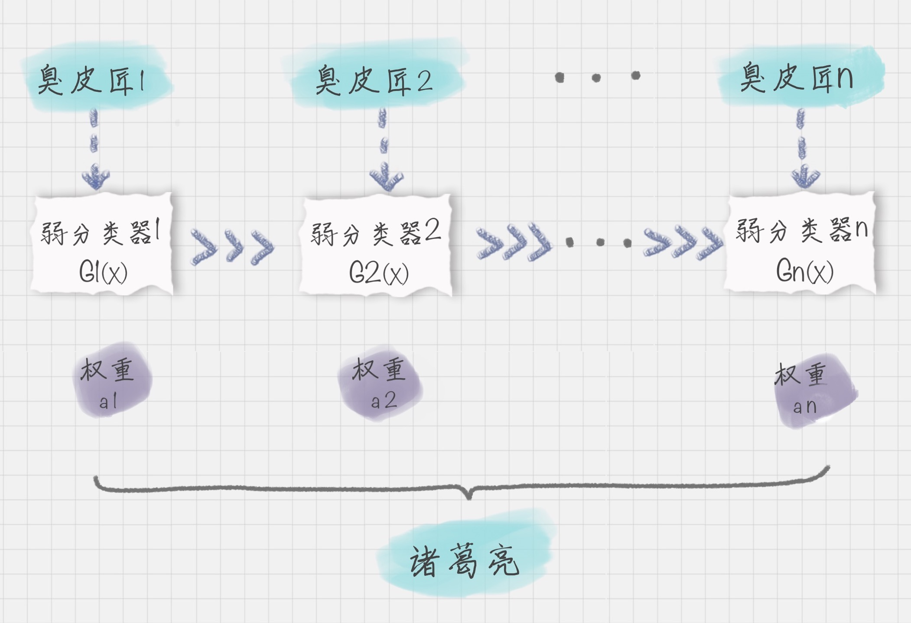
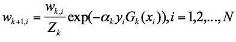

##前言
本节我们介绍AdaBoost算法原理及其工具包的使用。AdaBoost英文全称Adaptive-Boosting(自适应提升算法)。它和随机森林(Random-Forest)都是集成学习的一种，这里我们先介绍集成学习。

##集成学习
集成学习是将一系列弱学习器组合而成强学习器，从而得到更好的学习效果。弱学习器的预测效果仅仅比随机猜测的结果好一些，那么我们找到一个弱学习器的算法是很简单的，而很难直接发现一个强学习器算法。我们都知道“三个臭皮匠胜过一个诸葛亮”的道理，这个道理同样适用于机器学习，即若干个弱学习器组合抵过一个强学习器。
根据个体学习器间的依赖方式，我们可以将集成学习方法可分为两种：Bagging和Boosting。Bagging的个体学习器间不存在强依赖关系，可以说是并发进行的，Bagging通常对分类任务使用简单投票法，对回归任务使用简单平均法，典型代表有随机森林；Boosting类算法是串行的，个体学习间存在强依赖关系，本节介绍的AdaBoost就是Boosting算法的典型代表。

##AdaBoost工作原理

假设我们身处三国，打算起兵谋反干一番大事业，但无奈庙小招不来诸葛亮那样的军师，怎么办呢？难道就此罢手吗？不，我们虽然招不来诸葛亮，但平平凡凡的谋士还是能找不少的。每次攻打城池时，每个谋士都会给我们出谋划策，我们将他们的策略进行整合，同样可以胜过诸葛亮的计谋。在这个例子中，平凡的谋士就是弱学习器，诸葛亮是强学习器，通过逐个训练这些弱学习器，我们将得到强学习器的效果，这就是Boosting算法的原理。


下面我们以分类问题为例，来说明AdaBoost算法。假设弱分类器为Gi​(x)，它在强分类器的权重为αi，那么可以得出强分类器f(x):

这时我们要解决两个问题：
- 在每次迭代训练中，如何得到最优弱分类器

- 弱分类器的权重如何计算

先看第二个问题。对于一个弱分类器组成的强分类器，我们当然希望分类效果好的弱分类器所占的权重越大，而那些分类错误率高的分类器占更小的权重。事实上就是这样，AdaBoost算法正是根据分类错误率来决定每个分类器的权重，公式表示为:
    
其中ei表示第i个弱分类器的分类误差率，αi随着ei的增大而减小，即分类误差越大则权重越低。(ei ≤ 1/2时, αi ≥ 0)

接下来看第一个问题，如何在每次迭代中得到最好的弱分类器？

实际上，AdaBoost算法是通过调整样本的权重分布来实现的。在每次训练后，那些分类错误的样本的样本权重增大，从而得到更多的关注；分类正确的样本则降低权重，然后下一轮分类器训练时会给予前一次分类正确的样本更少的关注。这样一来，每次训练都会集中改善那些分类错误的样本，最终分类器的正确率得到提高。
我们用D(k+1)代表第k+1轮训练中样本分布的集合，其中W(k+1，i)代表第k+1轮训练中第i个样本的权重，因此用公式表示为:

第k+1轮中的样本权重，是根据该样本在第k轮的权重及第k个分类器的准确率而定，具体的公式为：


其中Zk是规范化因子，yi是第i个样本的分类，如果是二分类的话，则yi属于{-1 , 1}。


##AdaBoost工具

我们可以直接在sklearn中调用AdaBoost。这里有两种不同的AdaBoost，一种用于分类(AdaBoostClassifier)，一种用于回归(AdaBoostRegressor)。
```python
from sklearn.ensemble import AdaBoostClassifier
from sklearn.ensemble import AdaBoostRegressor
```
下面我们介绍这两个函数各自的构造参数。
AdaBoostClassifier(base_estimator=None, n_estimators=50, learning_rate=1.0, algorithm='SAMME.R', random_state=None):

- base_estimator: 组成强学习器的个体学习器，比如决策树桩(决策树只有一层划分的情况)。默认情况使用的就是决策树桩：DecisionTreeClassifier(max_depth=1)

- n_estimators: 弱分类器的最大数量，如果在达到最大数量前完全拟合，则提前结束训练

- learning_rate: 学习率，取值在0~1.0之间，默认为1.0。学习率和最大迭代次数(n_estimators)有相关性，如果学习率小，则需要更多的迭代次数；如果学习率大，则迭代次数减少

- algorithm: 代表我们使用哪种Boosting算法，有两种选择｛‘SAMME’, ‘SAMME.R’｝，默认为‘SAMME.R’。两者的区别在于对弱分类器权重的计算方式不同

- random_state:代表随机数种子的设置，默认是 None。随机种子是用来控制随机模式的，当随机种子取了一个值，也就确定了一种随机规则，其他人取这个值可以得到同样的结果。如果不设置随机种子，每次得到的随机数也就不同。

回归函数的参数：AdaBoostRegressor(base_estimator=None, n_estimators=50, learning_rate=1.0, loss='linear', random_state=None)。分类和回归的参数基本相同，不同之处在于回归函数有了个loss参数。它表示损失函数，默认为linear，可选择的范围是{‘linear’, ‘square’, ‘exponential’}。它们分别表示线性、平方和指数损失函数。一般情况下，线性损失函数就会取得不错的效果。


##实战：Tianic生存预测

我们以机器学习的经典案例“泰坦尼克号的生存预测”来练习刚学习的AdaBoost算法。同时我们用决策树来预测结果，最后比较两者的准确率。

Tianic数据集获取：https://github.com/cystanford/Titanic_Data

```python
#导入包
import pandas as pd
import numpy as np
import matplotlib.pyplot as plt
from sklearn.tree import DecisionTreeClassifier
from sklearn.ensemble import AdaBoostClassifier
from sklearn.metrics import accuracy_score
from sklearn.feature_extraction import DictVectorizer
from sklearn.model_selection import cross_val_score
from sklearn.metrics import zero_one_loss
```

```python
#读取数据
train_data = pd.read_csv('./train.csv')
test_data = pd.read_csv('./test.csv')
test_survived = pd.read_csv("./gender_submission.csv")
```


```python
#将test_survived的'Survived'列插入test_data中
test_data['Survived'] = test_survived['Survived']
```

```python
#数据清洗
# 使用平均年龄来填充年龄中的nan值
train_data['Age'].fillna(train_data['Age'].mean(), inplace=True)
test_data['Age'].fillna(test_data['Age'].mean(),inplace=True)
# 使用票价的均值填充票价中的nan值
train_data['Fare'].fillna(train_data['Fare'].mean(), inplace=True)
test_data['Fare'].fillna(test_data['Fare'].mean(),inplace=True)
# 使用登录最多的港口来填充登录港口的nan值
train_data['Embarked'].fillna('S', inplace=True)
test_data['Embarked'].fillna('S',inplace=True)

```

```python
# 特征选择
features = ['Pclass', 'Sex', 'Age', 'SibSp', 'Parch', 'Fare', 'Embarked']
train_features = train_data[features]
train_labels = train_data['Survived']
test_features = test_data[features]
test_labels  = test_data['Survived']
```

```python
#使用 sklearn 特征选择中的 DictVectorizer 类，用它将可以处理符号化的对象，将符号转成数字 0/1 进行表示
#比如将 Sex分为两列Sex=female和Sex=male，每列用0和1表示
dvec=DictVectorizer(sparse=False)
train_features=dvec.fit_transform(train_features.to_dict(orient='record'))
test_features = dvec.fit_transform(test_features.to_dict(orient = 'record'))
```
```python
#查看转化后特征属性的名字，可以看出，原本的Embarked分为了3个特征
dvec.feature_names_
'''
输出如下：
['Age',
 'Embarked=C',
 'Embarked=Q',
 'Embarked=S',
 'Fare',
 'Parch',
 'Pclass',
 'Sex=female',
 'Sex=male',
 'SibSp']
'''
```

```python
#AdaBoost模型预测与评估
n_estimators = 200   #迭代次数设置
ada_clf = AdaBoostClassifier(n_estimators = n_estimators)
ada_clf.fit(train_features , train_labels)     #训练模型
pred_ada = ada_clf.predict(test_features)           # AdaBoost预测
print("The AdaBoost's accuracy_score is %.4lf " % round(accuracy_score(test_labels , pred_ada) , 6))

[out]: The AdaBoost's accuracy_score is 0.9043
```
```python
#决策树模型预测与评估
dtree_clf = DecisionTreeClassifier()
dtree_clf.fit(train_features , train_labels)
pred_tree = dtree_clf.predict(test_features)
print("The DecisionTree's accuracy_score is %.4lf" % round( accuracy_score(test_labels , pred_tree), 6))

[out]: The DecisionTree's accuracy_score is 0.7655
```
```python
#使用k折交叉验证评估
ada_scores = cross_val_score(ada_clf , train_features , train_labels , cv = 10)
dtree_scores = cross_val_score(dtree_clf , train_features , train_labels , cv = 10)
print("The AdaBoost's cross_val_score is %.4lf " % round(np.mean(ada_scores) , 6))
print("The DecisionTree's cross_val_score is %.4lf" % round(np.mean(dtree_scores) , 6))  

[out]:
The AdaBoost's cross_val_score is 0.8115
The DecisionTree's cross_val_score is 0.7846
```
```python
#使用matplotlib可视化AdaBoost和决策树的正确率
#得到决策树正确率
dtree_score = dtree_clf.score(test_features , test_labels)
fig = plt.figure()
#设置plt显示中文
plt.rcParams['font.sans-serif'] = ['SimHei']
ax = fig.add_subplot(111)
ax.plot([1,n_estimators],[dtree_score]* 2,'k--', label=u'决策树模型 正确率')
ada_score = np.zeros((n_estimators,))
# 遍历每次迭代的结果 i为迭代次数, pred_y为预测结果
for i , pred_y in enumerate(ada_clf.staged_predict(test_features)):
    #统计正确率
    ada_score[i] = 1.0 - zero_one_loss(pred_y , test_labels)
# 绘制每次迭代的AdaBoost错误率
ax.plot(np.arange(n_estimators) + 1 , ada_score , label = 'AdaBoost Test 正确率' , color = 'orange')
ax.set_xlabel('迭代次数')
ax.set_ylabel('正确率')
leg=ax.legend(loc='upper right',fancybox=True)
plt.show()

```


```python
#使用matplotlib可视化AdaBoost和决策树的错误率
#得到决策树正确率
dtree_err = 1.0 - dtree_clf.score(test_features , test_labels)
fig = plt.figure()
#设置plt显示中文
plt.rcParams['font.sans-serif'] = ['SimHei']
ax = fig.add_subplot(111)
ax.plot([1,n_estimators],[dtree_err]* 2,'k--', label=u'决策树模型 错误率')
ada_err = np.zeros((n_estimators,))
# 遍历每次迭代的结果 i为迭代次数, pred_y为预测结果
for i , pred_y in enumerate(ada_clf.staged_predict(test_features)):
    #统计正确率
    ada_err[i] = zero_one_loss(pred_y , test_labels)
# 绘制每次迭代的AdaBoost错误率
ax.plot(np.arange(n_estimators) + 1 , ada_err , label = 'AdaBoost Test 错误率' , color = 'orange')
ax.set_xlabel('迭代次数')
ax.set_ylabel('错误率')
leg=ax.legend(loc='upper right',fancybox=True)
plt.show()
```


##参考

- [陈旸 数据分析45讲](https://time.geekbang.org/column/intro/147)

- [sklearn API官方文档](https://scikit-learn.org/stable/modules/classes.html#)

-  李航 《统计学习方法》

-  周志华 《机器学习》

- 《机器学习实战》

- 《利用Python进行数据分析》
