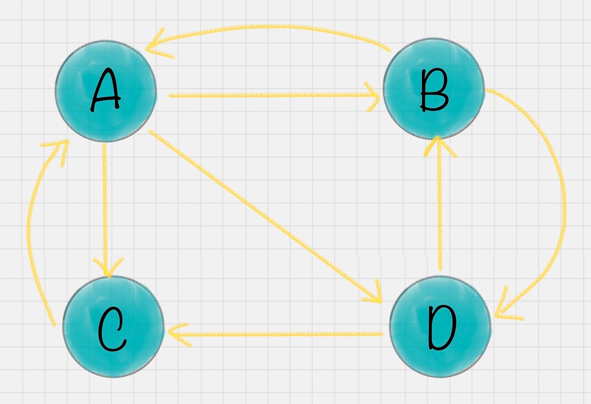
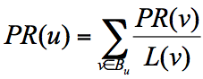
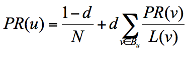
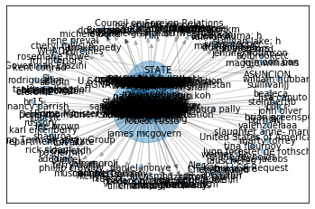
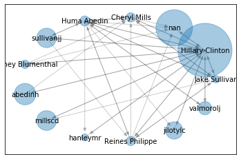

##前言
PageRank算法起源于搜索引擎，它的想法受到学术论文的影响力因子的启发，当一篇论文的引用次数越多，证明这篇论文的影响力越大。Google的两位创始人创造性地将论文的算法应用于搜索引擎，从而解决了一系列难题，加快了搜索引擎的发展。当然，除了搜索引擎之外，PageRank算法还可应用于其他领域。比如你的社交影响力、公司的影响力和社交网络质量等。


##PageRank简化模型

假设下图为4个网页A、B、C、D的连接信息：

出链：链接出去的链接。比如A-->B
入链：链接进来的链接。比如D-->B
如上图，A有3个出链，2个入链。
简单来说，一个网页的影响力 = 所有入链集合的页面的加权影响力之和。公式表示为：

PR(u)表示网页u的影响力，Bu表示网页u的入链集合，PR(v)表示网页v的影响力，L(v)表示网页v的出链数量。页面u的影响力来自于它的入链集合中每个页面v的影响力PR(v)与出链数量L(v)的比值，也就是页面v将自身的影响力平均分给它的每个出链。
跳转概率：1 / 网页出链数量。比如网页A的跳转链接有B、C、D，则跳转到B、C、D的概率均为1/3。


##PageRank的随机浏览模型
PageRank算法常会面临两个问题：
等级泄露(Rank Leak)： 如果一个网页只有入链而没有出链，那么可能会导致其它的网页PR值为0。
等级沉没(Rank Sink):  如果一个网页只有出链而没有入链，那么可能会导致该网页的PR值为0。
为了解决简化模型的上述两个问题，拉里佩奇(Google创始人之一)提出了PageRank随机浏览模型。他假定用户并不都是从跳转链接访问网页，还有一种用户直接输入网址访问其他网页，虽然这个概率较小。
他设定了阻尼因子d，代表用户按照跳转链接方式来上网的概率，通常取一个固定值0.85，而d=1-0.85=0.15则代表了用户不是通过跳转链接的方式访问网页的，比如直接输入网址。

N为网页总数，因为加入了阻尼因子d，一定程度上解决了等级泄露和等级沉没的问题。从数学上可以证明pagerank算法随机模型可以收敛，也就是可以得到一个稳定的PR值。

##PageRank使用

####工具包
sklearn工具包中没有PageRank算法的实现，但Python中有一个关于图论和网络建模的工具NetworkX，内置了常用的图和网络分析算法。如果没有的话，使用pip按照即可。安装命令：
```bash
pip install NetworkX
```
工具包导入：
```python
import networkx as nx
```

####创建图
图可以分为有向图和无向图两种。networkx提供了两种不同的函数来分别创建两种图。
无向图:
```python
graph = nx.Graph()
```
有向图:
```python
graph = nx.DiGraph()
```
####节点的增加、删除和查询
```python
graph.add_node('A')   #增加节点A
graph.add_nodes_from(['A' , 'B' , 'C' , 'D']) # 增加节点集合

graph.remove_node('A')  #删除节点A
graph.remove_nodes_from(['A' , 'B' , 'C' , 'D']) #删除节点集合

graph.nodes()   #得到graph的所有节点
graph.number_of_nodes() #得到graph的节点个数
```

####边的增加、删除和查询
```python
graph.add_edge('A' , 'B') #增加边A-->B
graph.add_edges_from([('A' , 'B') , ('C' , 'D')]) #增加边集合

graph.add_weighted_edges_from([('A' , 'B' , 3) , ('C' , 'D' , 5)]) #增加带权重的边集合

graph.remove_edge('A' , 'B') #删除指定边
graph.remove_edges_from([('A' , 'B') , ('C' , 'D')]) #删除边集合

graph.edges()   #访问图中所有边
graph.number_of_edges()  #得到图中边的个数

```

####计算每个节点的pagerank值
待到图创建好，边和节点设置好后，我们就可以计算每个节点的PageRank值，从而得到最有影响力的节点。
```python
result = nx.pagerank(graph , alpha = 0.85)  # 得到每个节点PR值，alpha默认为0.85，它就是阻尼因子d，表示用户按照跳转链接来上网的概率
```

##实战：希拉里邮件的人物关系

数据集获取: https://github.com/cystanford/PageRank

数据集介绍：

- Aliases.csv: 邮件所有人物的ID、别名

- Emails.csv: 记录发送者(MetadataFrom字段)和接受者(MetadataTo 字段)信息，邮件内容

- Persons.csv: 邮件所有任务的ID和姓名

####实战代码
```python
# -*- coding:utf-8 -*-
# 用 PageRank 挖掘希拉里邮件中的重要任务关系
#导入包
import pandas as pd
import numpy as np
import networkx as nx
import matplotlib.pyplot as plt
from collections import defaultdict
```

```python
#数据加载
emails = pd.read_csv('./PageRank-master/input/Emails.csv')
#读取别名文件
file = pd.read_csv('./PageRank-master/input/Aliases.csv')
aliases = {}
for index , row in file.iterrows():
    aliases[row['Alias']] = row['PersonId']
#读取人名文件
file = pd.read_csv('./PageRank-master/input/Persons.csv')
persons = {}
for index , row in file.iterrows():
    persons[row['Id']] = row['Name']
```
```python
#针对别名进行转换  aliases['Alias']  = Id <--> persons['Id']
def unify_name(name):
    #姓名统一小写
    name = str(name).lower()
    #去掉',' 和 '@'
    name = name.replace("," , "").split("@")[0]
    #别名转换
    if name in aliases.keys():
        name = persons[aliases[name]]
    return name
```
NetworkX提供了四种可视化布局:
- spring_layout: 呈中心放射状

- circular_layout: 在一个圆环上均匀分布节点

- random_layout: 随机分布节点

- shell_layout: 节点都放在同心圆上

```python
#绘制网络图
def show_graph(graph , layout = 'spring_layout'):
    #使用Spring Layout 布局，类似中心射状
    if layout == 'circular_layout':
        positions = nx.circular_layout(graph)  #circular_out呈现一个圆环上均匀分布节点
    else:
        positions = nx.spring_layout(graph)   
    # 设置网络图中的节点大小，大小与 pagerank 值相关，因为 pagerank 值很小所以需要 *20000
    nodesize = [x['pagerank'] * 20000 for v,x in graph.nodes(data=True)]
    #设置网络图的边长度
    edgesize = [np.sqrt(e[2]['weight']) for e in graph.edges(data = True)]
    #绘制结点
    nx.draw_networkx_nodes(graph , positions , node_size = nodesize , alpha = 0.4)
    #绘制边
    nx.draw_networkx_edges(graph , positions , edge_size = edgesize , alpha = 0.2)
    #绘制节点的label
    nx.draw_networkx_labels(graph , positions , font_size = 10)
    #输出希拉里邮件的所有人物关系图
    plt.show()
```

```python
#数据规范化
#将寄件人和收件人名字进行规范化
emails.MetadataFrom = emails.MetadataFrom.apply(unify_name)
emails.MetadataTo   = emails.MetadataTo.apply(unify_name)
# 设置遍的权重等于发邮件的次数
edges_weights_temp = defaultdict(list)  #defaultdict(list) 使得edges_weights_temp在查找key不成功时返回list
for row in zip(emails.MetadataFrom , emails.MetadataTo , emails.RawText):
    temp = (row[0] , row[1])
    if temp not in edges_weights_temp:
        edges_weights_temp[temp] = 1
    else:
        edges_weights_temp[temp] += 1
# 转化格式 (from, to), weight => from, to, weight
edges_weights = [(key[0] , key[1] , val) for key , val in edges_weights_temp.items()]
```

```python
#PageRank算法 ShowTime
#创建有向图
graph = nx.DiGraph()
#设置有向图的路径及权重(from , to , weight)
graph.add_weighted_edges_from(edges_weights)
# 计算每个节点（人）的 PR 值，并作为节点的 pagerank 属性
pagerank = nx.pagerank(graph)  
#将pagerank数值作为节点的属性
nx.set_node_attributes(graph , name = 'pagerank' , values = pagerank)
#画网络图
show_graph(graph)
```


上述图显示了所有的人物，但重要的人往往就那么几个，所以下面我们设定PR阈值，将许多低于阈值的人物去掉，达到精简网络图的目的。

```python
#将完整的图谱进行精简
# 设置 PR 值的阈值，筛选大于阈值的重要核心节点
pagerank_threshold = 0.005
#复制一份计算好的网络图
small_graph = graph.copy()
# 剪掉 PR 值小于 pagerank_threshold 的节点
for n , p_rank in graph.nodes(data = True):
    if p_rank['pagerank'] < pagerank_threshold:
        small_graph.remove_node(n)
# 画网络图,采用circular_layout布局让筛选出来的点组成一个圆
show_graph(small_graph, 'circular_layout')
```



##参考

- [陈旸 数据分析实战45讲](https://time.geekbang.org/column/intro/147)

- [NetworkX参考文档](https://networkx.github.io/documentation/networkx-1.10/reference/generated/networkx.algorithms.link_analysis.pagerank_alg.pagerank.html)
