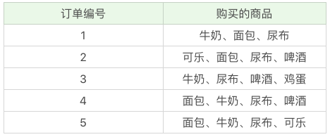

##前言
本文将介绍关联分析相关概念，以及关联分析的两个主流算法：Apriori和FP-Growth(Frequent Pattern Growth)。其中FP-Growth算法是对Apriori算法的改进。然后我们将通过一个实战案例来使用关联分析算法，做到随学随用。

### 啤酒与尿布
在沃尔玛超市我们会观察到一个奇怪的现象：货架上啤酒和尿布搭档在一起。这两个毫无关系的商品，怎么会放一块呢？
原来在美国，妇女们经常让她们回家的丈夫顺便到超市买一些尿布，而这些男人们在买完尿布后顺手就买一瓶啤酒。商家们通过长时间的商品分析，得出了这个令人匪夷所思却颇有成效的商品组合，从而大幅度提高了销量。啤酒和尿布一度成为营销界的经典案例。那么到这里，你可以看出关联分析的作用了吗？
**关联分析** 也称关联规则挖掘，是从大量数据中发现项与项的关系，商品捆绑销售就是个典型的应用场景，比如某宝上的书店经常会捆绑销售图书。

### 关联分析的基本概念
我们用一个超市的例子来搞清这些概念，下面是几名客户购买的商品名单：


#####支持度 Support
支持度是个百分比，它指的是某个商品组合出现的次数与总次数的比例。支持度越高，代表这个组合出现的频率越大。比如“牛奶+尿布”出现了4次，那么它的支持度为4/5 = 0.8。

#####置信度 Confidence
置信度指的是当你购买了商品A，有都多大概率你会购买商品B:
置信度｛牛奶->啤酒｝ = 2/4 = 0.5，4次购买牛奶中有两次购买啤酒，代表购买牛奶的情况下有0.5的概率购买啤酒；
置信度｛(面包，牛奶)->啤酒｝ = 2/3 = 0.67，3次购买牛奶和面包中2次购买啤酒，代表购买面包和牛奶的情况下有0.67的概率购买啤酒。

#####提升度 Lift
提升度(A->B) = 置信度(A->B) / 支持度(B)，商品推荐时重点考虑提升度，它表示商品A的出现对商品B出现概率提升的程度。
光考虑置信度是不可取的。如果一个组合的置信度为1，不一定它就可以带来销量提升。比如置信度(可乐->尿布) = 1，也就是买可乐的用户一定买尿布，然而这并不准确，就算用户不买可乐，他也会直接买尿布，所以可乐对尿布的提升作用不大。提升度(可乐->尿布) = 1 / 1 = 1。

提升度的三种可能:
- 提升度(A->B) < 1，有下降
- 提升度(A->B) = 1，无提升，无下降
- 提升度(A->B) > 1，有上升

#####频繁项集 frequent itemset

频繁项集是支持度大于等于最小支持度(Min Support)阈值的项集。
项集(itemset)可以是单个商品，也可以是商品组合。

#####关联规则
关联规则是我们最终所要挖掘的规律，它表示各个项之间的关系。

###Apriori算法
Apriori算法实际上是不断递归查找频繁项集，每次将小于最小支持度的项集筛选掉。下面我们看下它的**执行步骤**：
- step1: K = 1，计算K项集的支持度；

- step2: 筛选掉小于最小支持度的项集；

- step3: 如果项集为空，则对应K - 1项集的结果为最终结果

- 否则K = K + 1，重复1~3步


###FP-Growth算法

Apriori算法在运算过程中每次都会遍历频繁项集来计算支持度，如果频繁项集很大，那么算法的执行会耗费很多空间和时间。因此，人们后来提出FP-Growth算法，只需要遍历两次频繁项集，大大优化了时间复杂度。
FP算法可分为两步：1. 挖掘频繁项集；2. 挖掘关联规则。

#####挖掘频繁项集
挖掘频繁数据集分为创建项头表、构造FP树和挖掘频繁项集三步。
1. 创建项头表
扫描一遍数据集，删除掉小于最小支持度的单个项(K=1项集)，然后按照支持度从高到低排序。
项头表包含了项目、支持度和链表，初始时链表为空。

2. 构造FP树
FP树的根节点为NULL。
整个过程中再次扫描数据集，对于每一条数据，按照支持度从高到低的顺序创建节点，如果节点存在则count + 1，如果不存在则进行创建。同时在每次创建新的节点后，对应的项链表要更新。


3. 通过FP树挖掘频繁项集
得到 FP 树后，需要对每一个频繁项，逐个挖掘频繁项集。具体过程为：首先获得频繁项的前缀路径，然后将前缀路径作为新的数据集，以此构建前缀路径的条件 FP 树。然后对条件 FP 树中的每个频繁项，获得前缀路径并以此构建新的条件 FP 树。不断迭代，直到条件 FP 树中只包含一个频繁项为止。

##### 挖掘关联规则
关联规则挖掘首先需要对上文得到的频繁项集构建所有可能的规则，然后对每条规则逐个计算置信度，输出置信度大于最小置信度的所有规则。


### Apriori算法演练
Apriori工具包: efficient-apriori(使用pip安装该工具包)
```python
itemsets, rules = apriori(data, min_support, min_confidence)
```
data是我们所提供的数据集，它是一个list数据类型。min_support参数为我们的最小支持度，在 efficient-apriori 工具包中用 0 到 1 的数值代表百分比，比如 0.5 代表最小支持度为 50%。min_confidence 是最小置信度，数值也代表百分比，比如 1 代表 100%。

###实战：导演选角
从豆瓣中搜索导演名字，然后获取他每部电影的演员，使用关联分析挖掘导演使用演员的规律。
```python
# -*- coding: utf-8 -*-
#从豆瓣下载某个导演的数据集
from efficient_apriori import apriori
from lxml import etree
import time
from selenium import webdriver
import csv

driver = webdriver.Chrome('C:/Program Files (x86)/Google/Chrome/Application/chromedriver.exe')
#设置想要下载的导演 数据集
director = u'宁浩'
#写csv文件
file_name = './' + director + '.csv'
base_url = 'https://movie.douban.com/subject_search?search_text=' + director + '&cat=1002&start='
out = open(file_name , 'w' , newline = '' , encoding = 'utf-8-sig')
csv_write = csv.writer(out , dialect = 'excel')
flags = []

#下载指定页面的数据
def download(request_url):
    driver.get(request_url)
    time.sleep(1)
    html = driver.find_element_by_xpath("//*").get_attribute("outerHTML")
    html = etree.HTML(html)
    # 设置电影名称，导演演员的XPath
    movie_lists = html.xpath("/html/body/div[@id='wrapper']/div[@id='root']/div[1]//div[@class='item-root']/div[@class='detail']/div[@class='title']/a[@class='title-text']")
    name_lists = html.xpath("/html/body/div[@id='wrapper']/div[@id='root']/div[1]//div[@class='item-root']/div[@class='detail']/div[@class='meta abstract_2']")
    #获取返回数据的个数
    num = len(movie_lists)
    if num > 15: #第一页有16个数据
        #默认第一个不是，所以需要去掉
        movie_lists = movie_lists[1:]
        name_lists  = name_lists[1:]
    for (movie , name_list) in zip(movie_lists , name_lists):
        #存在数据为空的情况
        if name_list.text is None:
            continue
        #显示演员的名称
        print(name_list.text)
        names = name_list.text.split('/')
        #判断导演是否为指定的director
        if names[0].strip() == director and movie.text not in flags:
            #将第一个字段设为电影名称
            names[0] = movie.text
            flags.append(movie.text)
            csv_write.writerow(names)
    print('OK') #代表这页数据下载成功
    print(num)
    if num >= 14:  #有可能一页有14个数据
        #继续下一页
        return True
    else:
        #没有下一页
        return False


#开始的ID为0 ， 每页增加15
start = 0
while start <= 10000:  #最多抽取10000部电影
    request_url = base_url + str(start)
    #下载数据，看是否有下一页
    flag = download(request_url)
    if flag:
        start += 15
    else :
        break
out.close()
print('finished')
```
关联分析：
```python
lists = csv.reader(open(file_name , 'r' , encoding = 'utf-8-sig'))
#数据加载
data = []
for names in lists:
    name_new = []
    for name in names:
        #去除演员数据中的空格
        name_new.append(name.strip())
    data.append(name_new[1:])
#挖掘频繁项集和关联规则
itemsets , rules = apriori(data , min_support = 0.3 , min_confidence = 0.5)
print(itemsets)
print(rules)
```

###参考

- 陈旸 数据分析实战

- [频繁项集与关联规则 FP-growth 的原理和实现](https://www.ibm.com/developerworks/cn/analytics/library/machine-learning-hands-on2-fp-growth/index.html)
