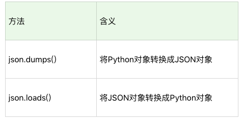

#数据采集

对一个合格的数据分析师来讲，高质量的数据才能得出高质量的结果。因此，数据采集是十分重要的一步。

##常用的数据源

####1. 开源数据源
开源数据一般是政府机构、公司和高校对外开放的数据，允许用户免费下载和使用。很多期刊论文研究都是针对数据源的，这样大家就可以用同样的数据集比较出算法的差异性。


####2. 爬虫抓取数据
我们常用的是Python爬虫，它的各方面库都比较成熟，适合多线程操作。下面介绍Python爬虫的常见流程：
- 使用Request库爬取网页信息

- 使用XPath解析网页内容。XPath是XML Path的缩写，XPath基于XML的树状结构，提供在数据结构树中找寻节点的能力。XPath可以通过元素和属性来进行位置索引

- 使用Pandas保存数据

除以上所提到的库外，常用的库还有Selenium，PhantomJS，或者用 Puppteteer 这种无头模式。


####3. 爬虫工具
“不要重复造轮子”。虽然编程爬虫是很有成就感的事情，但它往往会耗费大量的时间和人力。如果已经有人做好了相应的产品和服务，那我们拿来用就是，顶多花点钱，这样可以省下精力来投入到之后更重要的事情上。市面上有很多实用的爬虫工具，以下介绍一些受众范围广的爬虫利器：

- 集搜客
>特点是完全可视化操作，无需编程。集搜客没有流程的概念，用户只需要关注抓取什么数据，而流程细节交给集搜客处理

- 八爪鱼
> 八爪鱼有两个版本：免费版和云采集付费版本
>免费版本可使用一些采集模板包括了电商类、生活服务类、社交媒体类和论坛类的网站都可以采集，用起来非常方便。当然你也可以自己来自定义任务。
>云采集就是配置好采集任务后，交给八爪鱼的云端进行采集。八爪鱼一共有 5000 台服务器，通过云端多节点并发采集，采集速度远远超过本地采集。此外还可以自动切换多个 IP，避免 IP 被封，影响采集。


- 火车采集器
> 老牌采集器。它不仅可以做抓取工具，也可以做数据清洗、数据分析、数据挖掘和可视化等工作。数据源适用于绝大部分的网页，网页中能看到的内容都可以通过采集规则进行抓取。


####4. 日志采集
日志采集是运维的重要工作之一。日志采集通过分析用户的访问情况、执行操作以及系统错误，提升系统的性能，从而提高系统承载量。
日志采集可以分为两种形式：
- 通过Web服务端采集，例如 httpd、Nginx、Tomcat 都自带日志记录功能。同时很多互联网企业都有自己的海量数据采集工具，多用于系统日志采集，如 Hadoop 的 Chukwa、Cloudera 的 Flume、Facebook 的 Scribe 等，这些工具均采用分布式架构，能够满足每秒数百 MB 的日志数据采集和传输需求。
- 自定义采集用户行为，例如用 JavaScript 代码监听用户的行为、AJAX 异步请求后台记录日志等。


##Python爬虫
爬虫实际上是以浏览器访问的方式来模拟访问网站的过程，整个过程包括三个阶段：打开网页、提取数据和保存数据。
####Requests访问页面
Requests是Python HTTP的客户端，有两种方式：Get和Post。Get把参数包含在url中，而Post通过request body来传递参数。
```python
r = requests.get('http://www.douban.com') #r 就是Get请求访问后的结果，然后r.text和r.content来获取HTML的正文。
r = requests.post('http://xxx.com', data = {'key':'value'}) #使用Post进行表单传递，data就是表单传递的参数，为字典结构
```
####提取数据
提取数据主要用到两个工具。针对HTML页面，可以使用XPath进行元素定位；针对JSON数据，可以使用JSON解析。

######XPath定位
XPath是XML的路径语言，实际上通过元素和属性进行定位。下面是常见的几种表达方式：

举一些例子来说明：
1. xpath(‘node’) 选取了 node 节点的所有子节点；
2. xpath(’/div’) 从根节点上选取 div 节点；
3. xpath(’//div’) 选取所有的 div 节点；
4. xpath(’./div’) 选取当前节点下的 div 节点；
5. xpath(’…’) 回到上一个节点；
6. xpath(’//@id’) 选取所有的 id 属性；
7. xpath(’//book[@id]’) 选取所有拥有名为 id 的属性的 book 元素；
8. xpath(’//book[@id=“abc”]’) 选取所有 book 元素，且这些 book 元素拥有 id= "abc"的属性；
9. xpath(’//book/title | //book/price’) 选取 book 元素的所有 title 和 price 元素。

使用 XPath 定位，你会用到 Python 的一个解析库 lxml。这个库的解析效率非常高，使用起来也很简便，只需要调用 HTML 解析命令即可，然后再对 HTML 进行 XPath 函数的调用。

```python
from lxml import etree
html = etree.HTML(html)   # 利用lxml解析页面
result = html.xpath('//li') #定位所有列表项目
```
XPath获取方式：
- 在Chrome中下载XPath Helper插件

- 选定所要点击的元素，右击页面中选择检查

- 在打开的一栏中，必然会有一处被选中，右击-->Copy-->Copy XPath


######JSON数据

JSON(JavaScript Object Notation,JavaScript对象表示法)是一种轻量级的交互方式，在 Python 中有 JSON 库，可以让我们将 Python 对象和 JSON 对象进行转换。

```python
import json
jsonData = '{"a":1,"b":2,"c":3,"d":4,"e":5}';
print(json.loads(jsonData))      #将JSON对象转化为Python对象
josn.dumps(jsonData)      #将Python对象转化为JSON对象
```


####实战：爬取豆瓣宫崎骏电影海报

```python
import os
import json
import requests
from lxml import etree
from selenium import webdriver

request_url = 'https://search.douban.com/movie/subject_search?search_text=宫崎骏&cat=1002'
src_xpath = "//div[@class='item-root']/a[@class='cover-link']/img[@class='cover']/@src"
title_xpath = "//div[@class='item-root']/div[@class='detail']/div[@class='title']/a[@class='title-text']"
driver = webdriver.Chrome('C:/Program Files (x86)/Google/Chrome/Application/chromedriver.exe')
picpath = './images/宫崎骏电影海报'
if not os.path.isdir(picpath):
    os.mkdir(picpath)      #生成文件夹

def download(src , id):    #下载图片
    dir = picpath + '/' + str(id) + ".jpg"
    try:
        pic = requests.get(src , timeout = 10)      #发送请求
        fp = open(dir , "wb")     #二进制写入的形式打开文件
        fp.write(pic.content)   #写入图片
        fp.close()   #关闭文件
    except:
        print("图片无法下载")

for i in range(0 , 50 , 15): #范围根据网站的特点来编写
    url = request_url + '&start=' + str(i)
    driver.get(url)     #通过drive获取访问页面的完整drive
    html = etree.HTML(driver.page_source)    #解析网页
    srcs = html.xpath(src_xpath)    #定位电影海报图片
    titles = html.xpath(title_xpath)  #定位电影名字
    for src , title in zip(srcs , titles):
        print('\t'.join([str(src),str(title.text)]))
        download(src , title.text)
```


##Selenium测试工具

在Web自动化测试中，常常会用到Selenium或Puppeteer工具。这两个工具之间的区别在于：Selenium 更关注程序执行的流程本身，比如找到指定的元素，设置相应的值，然后点击操作。而 Puppeteer 是浏览者的视角，比如光标移动到某个元素上，键盘输入某个内容等。

通过这次的学习将掌握：
- 获取页面内容
- 点击网页上某个按钮
- 在网页的输入框中输入内容

####元素定位
在 Selenium Webdriver 中也提供了这 8 种方法方便我们定位元素：
1. 通过 id 定位：我们可以使用 find_element_by_id() 函数。比如我们想定位 id=loginName 的元素，就可以使用 browser.find_element_by_id(“loginName”)。
2. 通过 name 定位：我们可以使用 find_element_by_name() 函数，比如我们想要对 name=key_word 的元素进行定位，就可以使用 browser.find_element_by_name(“key_word”)。
3. 通过 class 定位：可以使用 find_element_by_class_name() 函数。
4. 通过 tag 定位：使用 find_element_by_tag_name() 函数。
5. 通过 link 上的完整文本定位：使用 find_element_by_link_text() 函数。
6. 通过 link 上的部分文本定位：使用 find_element_by_partial_link_text() 函数。有时候超链接上的文本很长，我们通过查找部分文本内容就可以定位。
7. 通过 XPath 定位：使用 find_element_by_xpath() 函数。使用 XPath 定位的通用性比较好，因为当 id、name、class 为多个，或者元素没有这些属性值的时候，XPath 定位可以帮我们完成任务。
8. 通过 CSS 定位：使用 find_element_by_css_selector() 函数。CSS 定位也是常用的定位方法，相比于 XPath 来说更简洁。

在我们获取某个元素之后，就可以对这个元素进行操作了，对元素进行的操作包括：
- 清空输入框的内容：使用 clear() 函数；
- 在输入框中输入内容：使用 send_keys(content) 函数传入要输入的文本；
- 点击按钮：使用 click() 函数，如果元素是个按钮或者链接的时候，可以点击操作；
- 提交表单：使用 submit() 函数，元素对象为一个表单的时候，可以提交表单；

####实战：微博自动化运营
```python
#微博自动登录
from selenium import webdriver
import time
browser = webdriver.Chrome('C:/Program Files (x86)/Google/Chrome/Application/chromedriver.exe')
#登录微博
def weibo_login(username , password):
    #打开微博登录页
    browser.get('https://passport.weibo.cn/signin/login')
    browser.implicitly_wait(5)            #等待数据加载完成，以免无法获得指定的元素
    time.sleep(1)
    #填写登录信息
    browser.find_element_by_id("loginName").send_keys(username)    
    browser.find_element_by_id("loginPassword").send_keys(password)
    time.sleep(1)
    #点击登录
    browser.find_element_by_id("loginAction").click()
    time.sleep(1)

#设置用户名和密码
username = 'XXX'
password = 'XXX'
weibo_login(username , password)

```

```Python
#添加指定的用户表
def add_follow_list(uid_list):
    for uid in uid_list:
        browser.get('https://weibo.com/u/'+str(uid))
        time.sleep(1)
        #browser.find_element_by_id("follow").click()
        follow_button = browser.find_element_by_xpath('//*[@id="Pl_Official_Headerv6__1"]/div[1]/div/div[2]/div[4]/div/div[1]/a[1]')
        follow_button.click()
        time.sleep(1)

uid_list = ['XXX' , 'XXX']
add_follow_list(uid_list)

```


```python
#给指定的某条微博添加内容
def add_comment(weibo_url , content):
    browser.get(weibo_url)
    browser.implicitly_wait(5)
    content_textarea = browser.find_element_by_css_selector("textarea.W_input").clear()
    content_textarea = browser.find_element_by_css_selector("textarea.W_input").send_keys(content)
    time.sleep(2)
    comment_button = browser.find_element_by_css_selector(".W_btn_a").click()
    time.sleep(1)

#发文字微博
def post_weibo(content):
    # 跳转到用户的首页
    browser.get("https://weibo.com")
    browser.implicitly_wait(5)
    #输入发布内容
    content_textarea = browser.find_element_by_css_selector("textarea.W_input").clear()
    content_textarea = browser.find_element_by_css_selector("textarea.W_input").send_keys(content)
    time.sleep(2)
    #点击发布按钮
    post_button = browser.find_element_by_css_selector("[node-type='submit']").click()

#给指定的微博评论
weibo_url = 'https://www.weibo.com/1890826225/IvlJhvj1Q?type=comment#_rnd1586748949983'
content = '每天都要加油!!!'
add_comment(weibo_url , content)
# 自动发微博
weibo_url = 'https://weibo.com'
content = "人所拥有的任何东西，都可以被剥夺，唯独人性最后的自由——也就是在任何境遇中选择一己态度和生活方式的自由——不能被剥夺。"
post_weibo(content)

```
